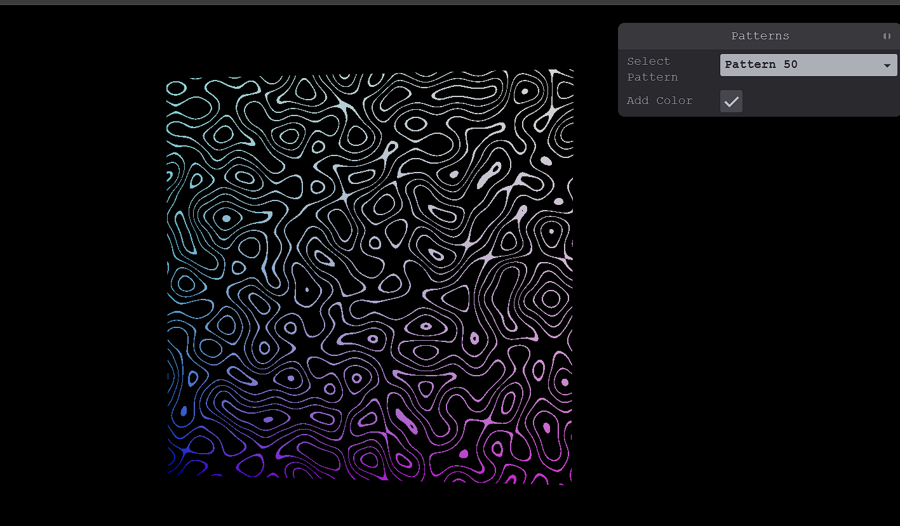

# 🧩 TSL Shader Patterns – Inspired by Three.js Journey


A full recreation of the **Shader Patterns** chapter from [Three.js Journey](https://threejs-journey.com/lessons/shader-patterns), rebuilt using:

- 🧱 [React Three Fiber](https://github.com/pmndrs/react-three-fiber)
- 🧪 [threejs Shading Language](https://github.com/mrdoob/three.js/wiki/Three.js-Shading-Language) – a node-based shader abstraction
- ⚡ [Vite](https://vitejs.dev/)
- 🧰 [Tweakpane](https://tweakpane.github.io/docs/) – for selecting patterns

---

## 🛠 Getting Started

Clone the project and run locally:

```bash
npm install
npm run dev
```

---

## 📷 Screenshot



---

## 🎨 Features

- 🔁 Real-time shader pattern switching via Tweakpane
- ✅ Toggle between grayscale and colored versions
- ⚛️ Fully built with TypeScript, React, and R3F
- 📦 Modular shader pattern system with clean separation
- 🧱 Inspired directly by the GLSL versions from Three.js Journey

---

## 🧠 Credits
Original inspiration from Three.js Journey by Bruno Simon
